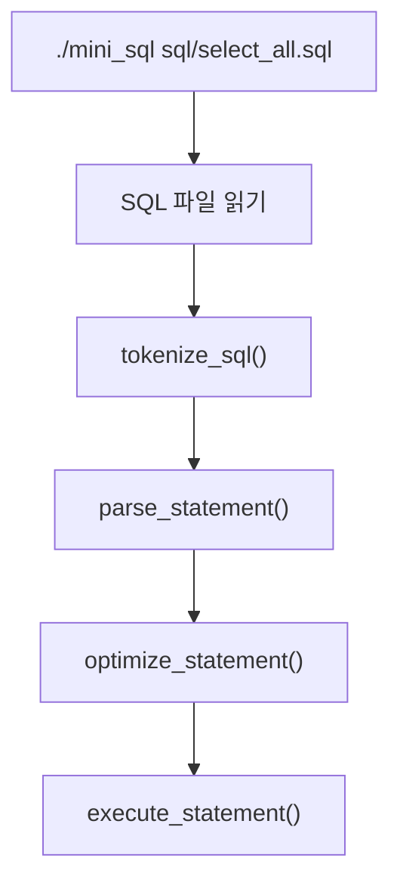
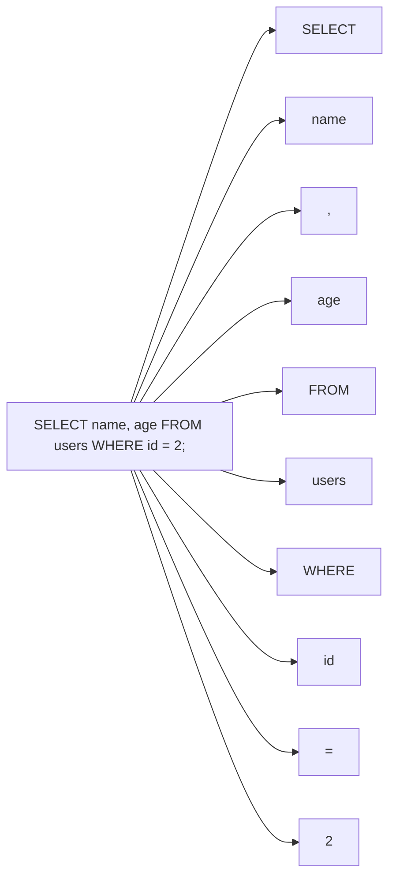
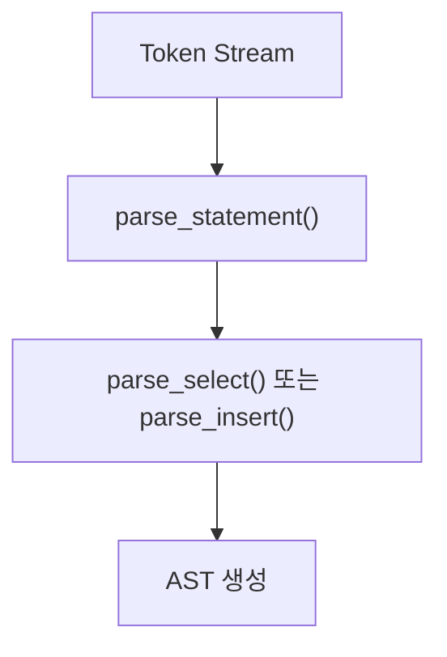
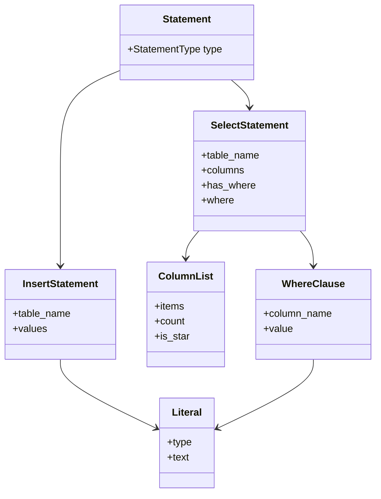
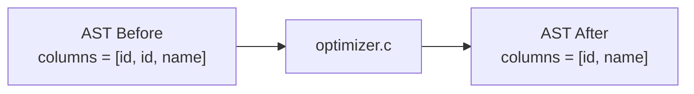
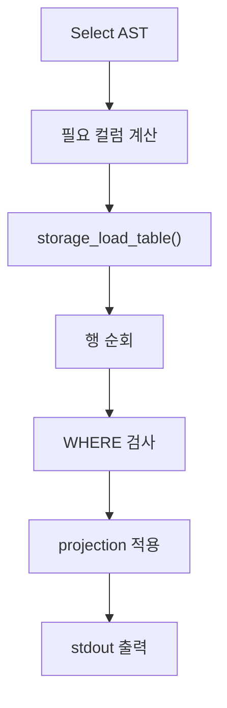
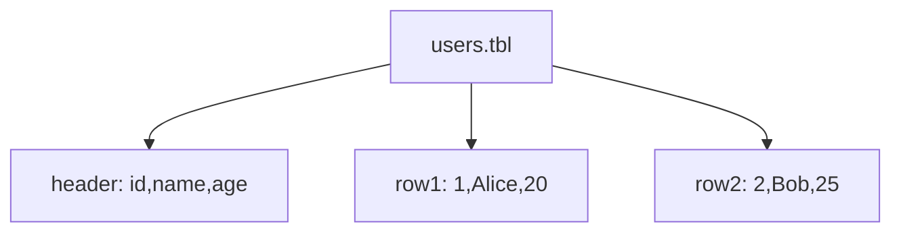
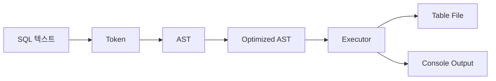
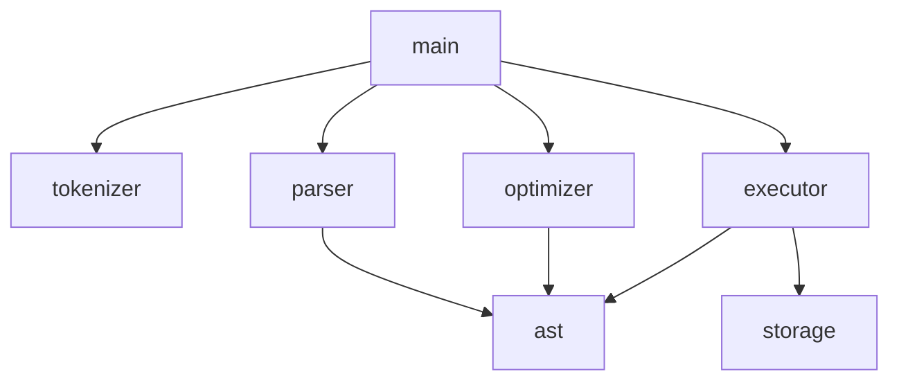

# mini_sql

학습용 최소 SQL 처리기입니다. 목표는 완전한 DBMS가 아니라, 작은 범위의 SQL을 직접 파싱하고 AST로 표현한 뒤, optimizer와 executor를 분리해서 이해하는 것입니다.

현재 버전은 의도적으로 `AST-only` 구조를 사용합니다.

- `Tokenizer` 가 SQL 문자열을 토큰으로 나눕니다.
- `Parser` 가 토큰을 AST로 바꿉니다.
- `Optimizer` 는 AST를 직접 수정하는 작은 rewrite 단계입니다.
- `Executor` 는 AST를 직접 해석해서 파일 기반 테이블을 읽고 씁니다.

즉, 지금은 `Logical Plan` 계층 없이도 끝까지 동작하는 최소 버전입니다.

## 프로젝트 개요

- 구현 언어: C
- 입력 방식: SQL 파일을 CLI 인자로 전달
- 저장소: 파일 기반 DB
- 테이블 저장 방식: `data/<table>.tbl`
- 현재 지원 SQL
  - `INSERT INTO table_name VALUES (value1, value2, ...)`
  - `SELECT * FROM table_name`
  - `SELECT col1, col2 FROM table_name`
  - `SELECT col1, col2 FROM table_name WHERE column = literal`
- 현재 미지원 SQL
  - `CREATE TABLE`
  - `UPDATE`, `DELETE`
  - `JOIN`
  - `ORDER BY`, `GROUP BY`
  - 복수 SQL 문장 파일
  - `AND`, `OR`
  - 콤마가 포함된 문자열 값

## 전체 처리 흐름 설명


현재 설계의 핵심은 다음 두 가지입니다.

- parser 결과를 반드시 AST로 만든다.
- optimizer와 executor는 분리하되, 둘 다 AST를 기준으로 동작한다.

이 구조는 과제 제출용으로 설명하기 쉽고, 처음 구현할 때 복잡도가 낮습니다.

## 왜 이런 구조로 설계했는지

이 프로젝트는 “최소 구현 우선”이 가장 중요합니다. 그래서 다음 원칙을 적용했습니다.

- SQL 문법은 작게 제한한다.
- 하지만 단순 문자열 `if/else` 분기 대신 tokenizer + parser + AST 구조를 둔다.
- optimizer는 AST를 직접 수정하는 작은 단계로 시작한다.
- executor는 AST를 직접 해석하는 interpreter 스타일로 유지한다.
- storage는 사람이 읽기 쉬운 텍스트 포맷을 사용한다.

즉, 지금은 구조를 과하게 일반화하지 않고, 발표와 학습에 가장 적합한 단순 형태를 선택했습니다.

## 파일 구조

```text
mini_sql/
├── Makefile
├── README.md
├── include/
│   ├── ast.h
│   ├── executor.h
│   ├── optimizer.h
│   ├── parser.h
│   ├── storage.h
│   ├── tokenizer.h
│   └── util.h
├── src/
│   ├── ast.c
│   ├── executor.c
│   ├── main.c
│   ├── optimizer.c
│   ├── parser.c
│   ├── storage.c
│   ├── tokenizer.c
│   └── util.c
├── data/
│   └── users.tbl
└── sql/
    ├── insert_user.sql
    ├── select_all.sql
    ├── select_duplicate_columns.sql
    ├── select_names.sql
    └── select_where.sql
```

## 단계별 학습 가이드라인

아래 순서대로 보면 가장 이해하기 쉽습니다.

---

## 1단계: 입력과 CLI 흐름 이해

먼저 프로그램이 어떤 입력을 받아 어떤 순서로 모듈을 호출하는지 확인합니다.

핵심 파일:

- `src/main.c`

CLI 흐름:



이 단계에서 봐야 할 것:

- SQL 파일이 문자열로 읽힌다.
- tokenizer -> parser -> optimizer -> executor 순으로 흘러간다.
- `main.c` 는 흐름만 연결하고 세부 로직은 각 모듈로 넘긴다.

이 단계에서 꼭 이해해야 하는 것:

- 프로그램의 진입점은 `main.c` 이다.
- 각 모듈은 서로 다른 책임을 가진다.
- main은 orchestration 역할만 한다.

다음 단계로 넘어가기 전에 확인할 질문:

- 왜 `main.c` 에서 모든 로직을 처리하지 않고 모듈을 나눴을까?
- optimizer를 parser 뒤, executor 앞에 두는 이유는 무엇일까?

---

## 2단계: tokenizer/parser 이해

이 단계에서는 SQL 문자열이 어떻게 구조화되는지 봅니다.

핵심 파일:

- `src/tokenizer.c`
- `src/parser.c`
- `include/tokenizer.h`
- `include/parser.h`

토큰화 과정:



파싱 과정:



설계 포인트:

- 범용 SQL parser를 만들지 않습니다.
- 현재 필요한 문법만 재귀 하강 방식으로 직접 파싱합니다.
- 하지만 결과는 반드시 AST 구조로 만듭니다.

이 단계에서 꼭 이해해야 하는 것:

- tokenizer는 문자열을 토큰으로 자른다.
- parser는 토큰 순서를 보고 문법 구조를 만든다.
- parser 결과는 문자열이 아니라 AST다.

다음 단계로 넘어가기 전에 확인할 질문:

- tokenizer와 parser를 분리하면 어떤 점이 좋아질까?
- 지금 지원하지 않는 문법을 추가하려면 parser에서 무엇을 더 만들어야 할까?

---

## 3단계: AST 구조 이해

이 단계에서는 SQL 의미를 어떤 C 구조체로 표현했는지 봅니다.

핵심 파일:

- `include/ast.h`
- `src/ast.c`

현재 AST 종류:

- `AST_SELECT_STATEMENT`
- `AST_INSERT_STATEMENT`

AST 구조도:



예시:

```sql
SELECT name, age FROM users WHERE id = 2;
```

AST는 대략 이렇게 표현됩니다.

```text
Statement(type=SELECT)
└── SelectStatement
    ├── table_name = "users"
    ├── columns = ["name", "age"]
    └── where
        ├── column_name = "id"
        └── value = "2"
```

이 단계에서 꼭 이해해야 하는 것:

- AST는 “사용자가 입력한 SQL의 의미”를 담는다.
- AST는 아직 실행 함수 호출 순서를 담지 않는다.
- executor는 이 AST를 읽어서 실제 작업을 수행한다.

다음 단계로 넘어가기 전에 확인할 질문:

- `SELECT *` 는 AST에서 어떻게 표현될까?
- `INSERT` 와 `SELECT` 가 왜 같은 `Statement` 아래 묶여 있을까?

---

## 4단계: optimizer 이해

현재 버전의 optimizer는 `AST를 직접 수정`합니다.

핵심 파일:

- `src/optimizer.c`
- `include/optimizer.h`

현재 실제 구현한 최적화:

1. projection 중복 제거

예를 들어

```sql
SELECT id, id, name FROM users;
```

는 optimizer 이후 내부적으로 다음처럼 정리됩니다.

```text
SELECT id, name FROM users;
```

시각화:



왜 이 정도만 넣었는가:

- 현재 문법 범위에서는 AST 단계에서 할 수 있는 rewrite가 많지 않습니다.
- 하지만 “optimizer가 AST를 입력받아 AST를 출력한다”는 구조는 분명하게 보여줄 수 있습니다.
- MVP에서는 작은 optimizer가 더 설명하기 쉽습니다.

현재 optimizer와 executor의 역할 구분:

- optimizer는 AST 자체를 더 단순하게 정리합니다.
- executor는 AST를 보고 실제 실행에 필요한 컬럼 목록을 계산합니다.

예를 들어 `SELECT name, age FROM users WHERE id = 2` 일 때, executor는 AST를 보고 실제 파일 로딩 시 필요한 컬럼을 `name, age, id` 로 계산합니다. 이것은 별도 logical plan을 만드는 것이 아니라, AST에서 바로 실행 준비 정보를 추출하는 것입니다.

이 단계에서 꼭 이해해야 하는 것:

- 현재 optimizer는 AST rewrite 단계다.
- executor의 실행 준비와 optimizer의 AST 단순화는 서로 다르다.
- 지금은 plan 계층 없이도 작은 최적화를 보여줄 수 있다.

다음 단계로 넘어가기 전에 확인할 질문:

- optimizer가 AST를 직접 수정하면 어떤 점이 단순해질까?
- 반대로 어떤 순간에는 AST-only optimizer가 불편해질까?

### optimizer를 확장하려면 어떻게 해야 하나

이 프로젝트에서 optimizer를 확장할 때는 아래 순서를 권장합니다.

1. 먼저 parser가 새 문법을 AST로 표현할 수 있게 만든다.
2. 그다음 optimizer에서 “의미는 유지하면서 AST를 더 단순하게 만드는 rule” 을 추가한다.
3. 마지막에 executor는 단순해진 AST를 그대로 해석하게 유지한다.

현재 AST-only 구조에서 추가하기 좋은 optimizer 예시:

- 중복 projection 제거
- `WHERE a = 1 AND TRUE` 같은 조건에서 불필요한 조건 제거
- 상수 folding
- 비교식 정규화
- 중첩된 조건식 단순화

현재 AST-only 구조에서 optimizer를 쓸 때의 규칙:

- parser는 “입력을 있는 그대로 구조화”하는 데 집중한다.
- optimizer는 “의미는 같지만 더 단순한 AST”를 만든다.
- executor는 “최적화된 AST를 실행”하는 데 집중한다.

언제 AST-only가 한계에 부딪히는가:

- `JOIN` 이 생길 때
- `ORDER BY`, `GROUP BY` 같은 단계형 연산이 생길 때
- 여러 실행 전략 중 하나를 선택해야 할 때
- scan/filter/project 같은 연산 트리를 명시적으로 다루고 싶을 때

그 시점이 되면 다음 단계로 `AST -> Logical Plan -> Optimizer -> Executor` 구조로 확장하면 됩니다. 즉, 지금은 AST-only MVP이고, 이후 복잡도가 커지면 plan 계층을 도입하면 됩니다.

---

## 5단계: executor 이해

executor는 AST를 직접 해석하는 interpreter 스타일입니다.

핵심 파일:

- `src/executor.c`
- `include/executor.h`

SELECT 실행 흐름:



INSERT 실행 흐름:


여기서 중요한 점:

- executor는 AST를 그대로 읽는다.
- 별도 plan을 만들지 않는다.
- 하지만 실행 전에 “실제로 필요한 컬럼”은 계산한다.

예를 들어

```sql
SELECT name, age FROM users WHERE id = 2;
```

는 출력 컬럼은 `name, age` 이지만, 필터를 검사하려면 `id` 도 읽어야 합니다. 그래서 executor가 내부적으로 필요한 컬럼 목록을 `name, age, id` 로 계산한 뒤 storage에 넘깁니다.

이 단계에서 꼭 이해해야 하는 것:

- executor는 AST를 보고 바로 동작한다.
- projection과 filter는 executor 내부에서 처리된다.
- 현재 구조는 interpreter 방식이라 흐름 설명이 쉽다.

다음 단계로 넘어가기 전에 확인할 질문:

- executor가 왜 `WHERE` 컬럼도 함께 읽어야 할까?
- AST-only 구조에서 executor가 너무 똑똑해지면 어떤 문제가 생길까?

---

## 6단계: storage 이해

이 단계에서는 파일 저장 형식과 실제 읽기/쓰기를 봅니다.

핵심 파일:

- `src/storage.c`
- `include/storage.h`
- `data/users.tbl`

테이블 파일 예시:

```text
id,name,age
1,Alice,20
2,Bob,25
```

구조 설명:

- 첫 줄은 schema 역할의 컬럼 이름
- 이후 줄은 각 row 데이터

테이블 파일 구조 도식:



이 포맷을 고른 이유:

- 사람이 직접 열어볼 수 있다.
- 디버깅이 쉽다.
- 과제 발표 때 설명하기 쉽다.
- `CREATE TABLE` 없이도 샘플 테이블을 바로 만들 수 있다.

주의:

- 현재 구현은 단순 CSV 계열이라 문자열 안에 콤마가 들어가면 지원하지 않습니다.
- 타입 시스템은 아직 없고, 값은 문자열로 저장됩니다.

이 단계에서 꼭 이해해야 하는 것:

- storage는 파일 입출력만 담당한다.
- schema는 첫 줄 헤더로 표현된다.
- executor가 계산한 필요 컬럼 목록에 따라 부분 로딩이 가능하다.

다음 단계로 넘어가기 전에 확인할 질문:

- 왜 첫 줄 헤더 방식이 MVP에 적합할까?
- storage가 parser나 optimizer를 알 필요가 없는 이유는 무엇일까?

---

## 7단계: end-to-end 실행 흐름 이해

이제 전체를 한 번에 연결해서 봅니다.

핵심 파일:

- `src/main.c`
- `src/tokenizer.c`
- `src/parser.c`
- `src/optimizer.c`
- `src/executor.c`
- `src/storage.c`

전체 end-to-end 구조도:



모듈 관계도:



이 단계에서 꼭 이해해야 하는 것:

- 이 프로젝트는 작은 SQL 엔진이지만 계층 분리가 분명하다.
- parsing, optimization, execution이 실제 코드에서 나뉘어 있다.
- 지금은 AST-only 구조지만, 이후 필요하면 plan 계층으로 확장할 수 있다.

다음 단계로 넘어가기 전에 확인할 질문:

- 새 문법을 추가하려면 어떤 파일부터 수정해야 할까?
- optimizer를 확장할 때 AST rewrite만으로 충분한가, 아니면 plan 계층이 필요한가?

## 최소 구현에서 어디까지 지원하는지

현재 지원 범위:

- 단일 SQL 문장 파일
- `INSERT INTO table VALUES (...)`
- `SELECT * FROM table`
- `SELECT col1, col2 FROM table`
- `SELECT ... FROM table WHERE column = literal`

일부러 미지원한 것:

- SQL 표준 전체
- 타입 검사
- 복합 expression
- 복합 조건
- 조인
- 인덱스
- 트랜잭션

이렇게 제한한 이유는 구조 설명 가능성을 유지하면서도, optimizer 실험 지점을 최소 비용으로 확보하기 위해서입니다.

## 빌드 방법

```bash
make
```

실행 파일:

```text
./mini_sql
```

## 실행 방법

기본 데이터 디렉터리 `data/` 사용:

```bash
./mini_sql sql/select_all.sql
./mini_sql sql/select_names.sql
./mini_sql sql/select_where.sql
./mini_sql sql/select_duplicate_columns.sql
./mini_sql sql/insert_user.sql
```

다른 데이터 디렉터리를 쓰고 싶다면:

```bash
./mini_sql --data-dir data sql/select_all.sql
```

## 샘플 SQL 파일 예시

`sql/select_all.sql`

```sql
SELECT * FROM users;
```

`sql/select_names.sql`

```sql
SELECT id, name FROM users;
```

`sql/select_where.sql`

```sql
SELECT name, age FROM users WHERE id = 2;
```

`sql/select_duplicate_columns.sql`

```sql
SELECT id, id, name FROM users;
```

`sql/insert_user.sql`

```sql
INSERT INTO users VALUES (3, 'Carol', 30);
```

## 예상 실행 결과 예시

`./mini_sql sql/select_all.sql`

```text
id,name,age
1,Alice,20
2,Bob,25
```

`./mini_sql sql/select_names.sql`

```text
id,name
1,Alice
2,Bob
```

`./mini_sql sql/select_where.sql`

```text
name,age
Bob,25
```

`./mini_sql sql/select_duplicate_columns.sql`

```text
id,name
1,Alice
2,Bob
```

`./mini_sql sql/insert_user.sql`

```text
Inserted 1 row into users
```

이후 다시 `SELECT *` 를 실행하면:

```text
id,name,age
1,Alice,20
2,Bob,25
3,Carol,30
```

## 발표할 때 설명 포인트

발표에서는 기능 수보다 “왜 이 구조를 골랐는가”를 중심으로 설명하는 것이 좋습니다.

1. 왜 tokenizer와 parser를 분리했는가
   - 단순 문자열 분기보다 문법 확장이 쉽고 구조 설명이 명확하다.

2. 왜 AST를 만들었는가
   - parser 결과를 구조체로 남겨야 optimizer와 executor를 분리할 수 있다.

3. 왜 현재는 AST-only 구조인가
   - MVP에서는 logical plan 없이도 충분히 동작한다.
   - 구조가 단순해서 학습과 발표에 유리하다.

4. optimizer는 무엇을 하는가
   - 현재는 AST rewrite만 담당한다.
   - 예시로 projection 중복 제거를 실제 코드로 보여줄 수 있다.

5. executor는 무엇을 하는가
   - AST를 직접 해석해서 파일을 읽고 쓴다.
   - SELECT에서는 필요한 컬럼만 읽도록 준비한다.

6. 언제 구조를 더 키워야 하는가
   - JOIN, 정렬, 집계, 복합 조건 최적화가 들어가면 그때 logical plan 계층을 도입하면 된다.

## 코드 읽기 추천 순서 요약

```text
1. src/main.c
2. src/tokenizer.c
3. src/parser.c
4. include/ast.h / src/ast.c
5. src/optimizer.c
6. src/executor.c
7. src/storage.c
```

이 순서대로 보면 “입력 -> 구조화 -> AST 정리 -> 실행 -> 파일 저장” 흐름이 자연스럽게 이해됩니다.
